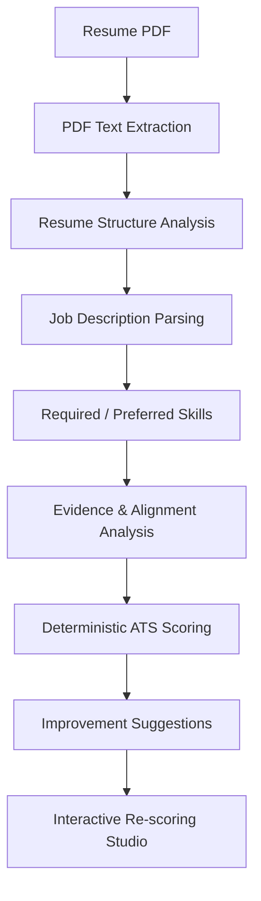

<div align="center">


<br /><br />

# RESUMIND — AI Resume Analyzer

<p align="center">
  <strong>A high-performance, local-first resume and job description analysis platform engineered for deterministic ATS scoring, evidence-backed alignment diagnostics, and real-time interactive re-scoring.</strong>
</p>

<p align="center">
  
  
  
  
  
  
</p>

</div>

---

## 🚀 Live Demo

Experience the deployed application directly in your browser:

### 👉 **[Open RESUMIND](https://chatgpt.com/c/VERCEL_URL)**

> **Privacy Notice:** RESUMIND executes entirely in your browser. All resume text extraction, natural language processing, and ATS score evaluations run client-side with zero data transmission to external servers.

---

## 📌 Project Status

- ✅ **Production deployed**
- ✅ **Testing completed**
- ✅ **Security audit completed**
- ✅ **Performance audit completed**
- ✅ **Vercel deployment completed**

---

## 🌟 Major Capabilities

- **PDF Resume Extraction**: In-browser document decoding powered by PDF.js to extract structural text and metadata with zero server upload.
- **Deterministic ATS Scoring**: Consistent, transparent multi-factor scoring (Keyword Match, Structure, Parseability, and Content Quality) with zero score drift across evaluations.
- **Job Description Parsing**: Automated extraction and tokenization of core competencies, job requirements, and technical prerequisites.
- **Required vs Preferred Skill Analysis**: Clear separation of mandatory qualifications from good-to-have capabilities to mirror modern enterprise ATS behavior.
- **Skill Evidence Analysis**: Context-aware verification ensuring identified skills are backed by concrete project work and quantifiable achievements.
- **Resume/JD Alignment Diagnostics**: In-depth alignment reporting identifying missing keywords, structural gaps, and relevance opportunities.
- **ATS Dashboard and Explainability**: Granular metric breakdown with visual gauges, category weights, and detailed scoring explanations.
- **Interactive Real-Time Re-Scoring**: Live editing studio allowing users to modify resume bullet points or job descriptions and instantly view updated scores.
- **Resume Improvement Suggestions**: Targeted, non-destructive recommendations engineered to address concrete alignment gaps.
- **Accept / Reject / Reset Workflow**: One-click review loop to accept suggested enhancements, stage changes, or restore baseline data at any time.
- **Local-First Processing**: 100% private, offline-capable architecture where all data remains securely in the user's browser session.

---

## 🏗️ Architecture & Pipeline

The RESUMIND processing pipeline operates through a sequential, deterministic evaluation flow:

```text
Resume PDF
    ↓
PDF Text Extraction
    ↓
Resume Structure Analysis
    ↓
Job Description Parsing
    ↓
Required / Preferred Skills
    ↓
Evidence & Alignment Analysis
    ↓
Deterministic ATS Scoring
    ↓
Improvement Suggestions
    ↓
Interactive Re-scoring
```



---

## 🔒 Privacy & Local-First Architecture

RESUMIND is architected from the ground up to protect sensitive candidate data:

- **Resume parsing and ATS analysis run locally**: The entire analysis engine executes on the user's machine within the client runtime.
- **Puter AI/KV/FS are disabled by default**: Core workflows rely entirely on robust local processing rather than remote cloud dependencies.
- **No external credentials are required for core functionality**: Complete resume parsing, scoring, and editing operate seamlessly without mandatory API keys or login walls.
- **Resume analysis data is stored locally in the browser**: Resumes, parsed tokens, and revision states are persisted securely using `localStorage` and `sessionStorage`.

---

## 🧪 Testing & Quality Assurance

All metrics and benchmarks reflect audited figures from the testing suite:

- **81/81 automated tests passed**
- **TypeScript typecheck: 0 errors**
- **Production build verified**
- **50-run deterministic ATS consistency test: 0 variance**
- **Local ATS pipeline: <10 ms in benchmark**
- **Core functionality verified**
- **Security audit completed**
- **Performance audit completed**

---

## 🛠️ Technical Stack

- **Frontend Framework**: React 19
- **Type Safety**: TypeScript 5.8
- **Routing & SSR Architecture**: React Router v7
- **Styling**: Tailwind CSS v4
- **Build Tool & Bundler**: Vite 6
- **PDF Extraction**: PDF.js (`pdfjs-dist`)
- **State Management**: Zustand
- **File Upload**: React Dropzone
- **Version Control & Hosting**: Git, GitHub, Vercel

---

## 🚀 Getting Started

### Prerequisites

- Node.js (v18.0.0 or higher recommended)
- npm or yarn

### Installation

1. Clone the repository:
   ```bash
   git clone https://github.com/AyanThara/Ai-Resume-Analyser.git
   ```

2. Navigate to the project directory:
   ```bash
   cd Ai-Resume-Analyser
   ```

3. Install project dependencies:
   ```bash
   npm install
   ```

4. Launch the local development server:
   ```bash
   npm run dev
   ```

5. Open your browser and navigate to:
   ```text
   http://localhost:5173
   ```

### Production Build & Type Checking

To validate TypeScript types across the project:
```bash
npm run typecheck
```

To create and verify a production-optimized build:
```bash
npm run build
```

---

## 👤 Author

**Ayan Thara**
- GitHub: [@AyanThara](https://github.com/AyanThara)
